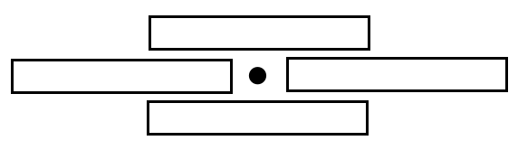
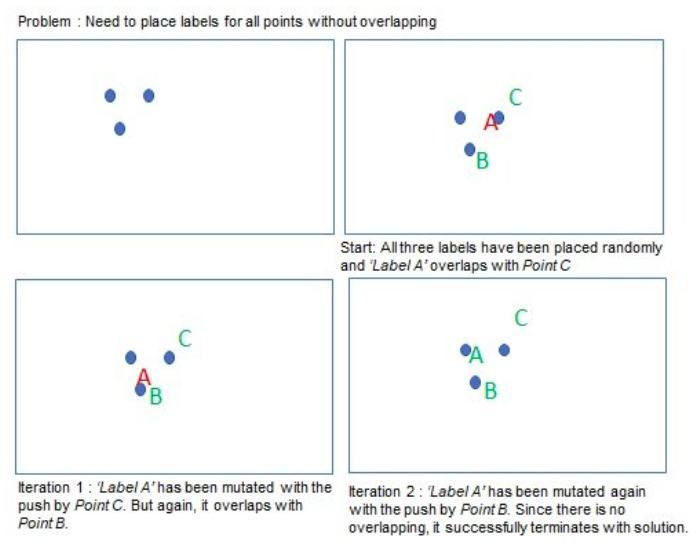
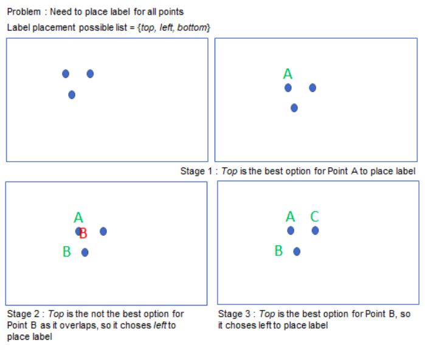

# Automatic Label Placement
> Simple point labeling exercise with Python

## Table of contents
* [Introduction](#introduction)
* [Exercise](#exercise)
* [Requirements](#requirements)
* [Local Search Algorithm](#local search algorithm)
* [Greedy Algorithm](#greedy algorithm)
* [Usage](#usage)
* [Contact](#contact)

## Introduction
Automatic label placement, sometimes called text placement or name placement, 
comprises the computer methods of placing labels automatically on a map or 
chart. This is related to the typographic design of such labels.

## Exercise
Generate 1000 random points in a square area of 2000 x 2000 units; each point 
has a radius of 1 unit. For a random selection of 200 of these points, add a 
label. This would normally be text (e.g. a name of a town on a map), but for 
simplicity just use an empty rectangular box. These label boxes should have a 
height of 23 units, and a width of 88 units.

[Local search algorithm](#local search algorithm) and 
[greedy algorithm](#greedy algorithm) have been implemented in this project 
to minimize the number of overlaps between labels with other labels 
or with points. The optimization has 1 degree of freedom: the placement of 
the label with respect to the point it belongs to. It may only be placed in 
one of four positions: to the right, above, below or to the left of the 
point (see the figure below).

Visualize the result in a picture, showing all points and labels, with any 
remaining overlapping labels colored red.

  

## Local Search Algorithm

  

## Greedy Algorithm

  

## Requirements
See [pyproject.toml](./pyproject.toml)

## Usage
Run 
[local_search_algorithm.py](./automatic_label_placement/local_search_algorithm/local_search_algorithm.py) 
and 
[greedy_algorithm.py](./automatic_label_placement/greedy_algorithm/greedy_algorithm.py) to see 
the results.

## Contact
Created by [Jeff Chen](mailto:jeff73511@msn.com) - feel free to contact me!